 

 

 Sobre mí" />

<table>
  <tr>
    <td width="50%">
      
    </td>
    <td width="50%">
      <h3>¡Hola! Soy Cristian Castillo 👋</h3>
      
Desarrollador Full Stack apasionado por la arquitectura limpia y por construir cosas que si funcionan jaja :p 

       
      <ul>
        <li>📍 <b>Base de operaciones:</b> Concepción, Chile.</li>
        <li>💻 <b>Stack principal:</b> C#, .NET, React, SQL Server. Y Ustedes saben. Todo lo adicional que implica.</li>
        <li>⚙️ <b>Actualmente trabajando en:</b> Sistemas de tótems, Estacionamientos y Plataformas web (C# / React / Tailwind / .NET / SQL).</li>
        <li>🎲 <b>Cuando no estoy programando:</b> Me encuentras jugando alguna cosilla, Faneando One Piece o Viviendo la vida fuera de las Pantallas.</li>
      </ul>
    </td>
  </tr>
</table>

> [!NOTE]
> **Nota de Actividad:** La mayor parte de mi desarrollo profesional ocurre en **repositorios privados empresariales** y servidores locales (Azure DevOps / On-Premise).
> *Este perfil es solo la punta del iceberg.* 🧊

 

 Stack" />

**Languages**

 

**Frameworks and Libraries**

 

**Software**

 

**Cloud and Providers**

 

 Stats & Activity" />

  

  

 

 Contributions" />

 

